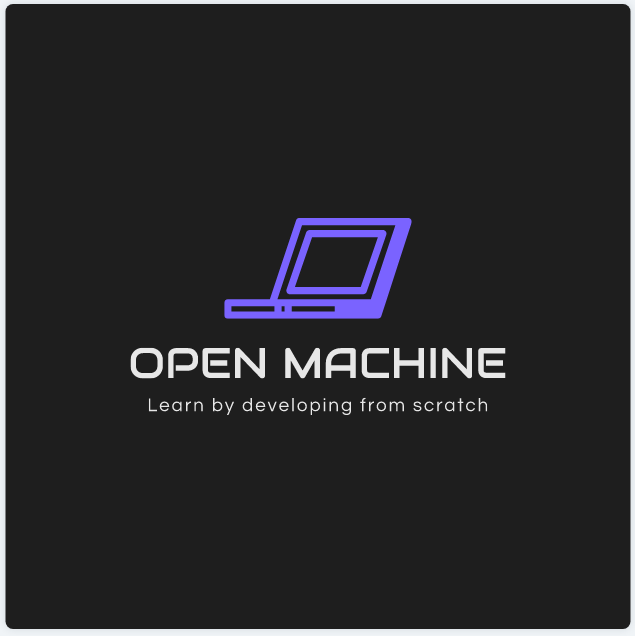

### Hi there, I'm Luca Dillenburg 👋

## I'm a Entrepreneur and Full-Stack Developer!

- 🔭 I’m currently working on a [Open-Source Computer][openmachine-organization]!
- 🌱 I’m currently learning GoLang, Flutter and Design
- 👯 I’m looking to collaborate with other entrepreneurs and fullstack developers
- 🥅 2020 Goals: Create a Startup and build my own computer from scratch
- 💬 Ask me about entrepreneurship, Flutter and GoLang
- ⚡ Fun fact: I love extreme sports

### Connect with me:

[][linkedin]
[][instagram]
[][gmail]

 
 

### Organizations:
[][openmachine-organization]

---

  
🧭 Languages and Tools

  
  
  
  

  
  
  
  
  
   

  
📕 Articles

  <!-- BLOG-POST-LIST:START -->
  - [Article Name](https://medium.com/)
  <!-- BLOG-POST-LIST:END -->

  
:zap: Github Stats

  

   

[openmachine-organization]: https://github.com/Open-Machine
[linkedin]: https://linkedin.com/in/codeSTACKr
[instagram]: https://instagram.com/LucaDillenburg
[gmail]: mailto:luca.assumpcao.dillenburg@gmail.com
